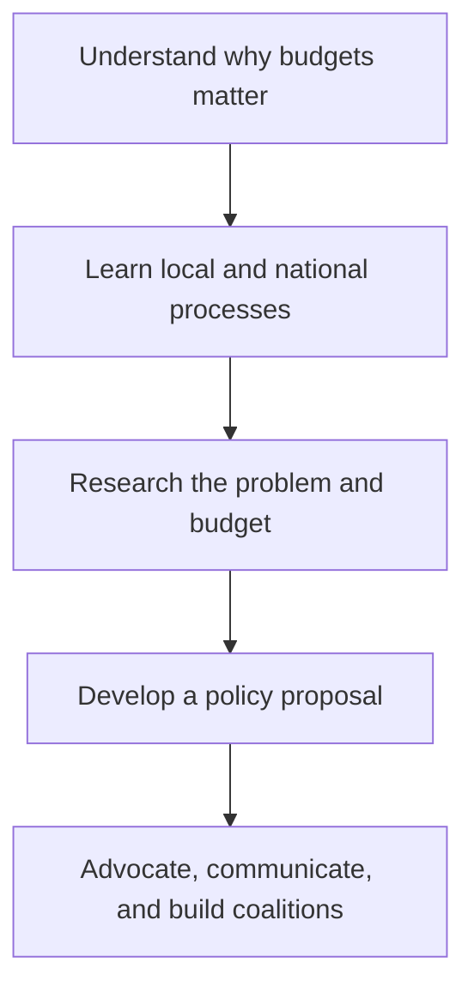

The 122-page guidebook is structured as a practical journey from understanding the public budget to organizing a sustained advocacy campaign.

| Section                                             |   Pages | Main purpose                                                                                                                  |
| --------------------------------------------------- | ------: | ----------------------------------------------------------------------------------------------------------------------------- |
| Front matter                                        |     1–6 | Title, partner organizations, acknowledgments, and contents                                                                   |
| Introduction                                        |    7–13 | Purpose of the guidebook, the Young Budget Leaders Program, participant profiles, and the guide’s civic-participation framing |
| Chapter 1: Anchoring Our Budget Advocacy            |   14–19 | Explains why citizens should engage in budgeting and introduces community listening as the starting point                     |
| Chapter 2: Citizen Participation in Local Budgeting |   20–33 | Covers the local budget cycle, decision-makers, devolution, and entry points for civil-society participation                  |
| Chapter 3: Engaging the National Budget             |   34–49 | Explains fiscal policy, resource allocation, the national budget cycle, and basic approaches to analyzing the national budget |
| Chapter 4: Understanding the Numbers                |   50–59 | Introduces budget research as a way of defining social problems and developing evidence-based responses                       |
| Chapter 5: Using Research for Budget Advocacy       |   60–73 | Moves from research into policy analysis, including developing and evaluating policy or budget proposals                      |
| Chapter 6: Continuing Budget Work with Others       |   74–85 | Focuses on coalition advocacy, lobbying, evidence-based messaging, and communications strategy                                |
| Annex 1: The Philippine Budget Cycle                |   86–93 | More detailed reference on preparation, legislation, execution, and accountability                                            |
| Annex 2: Building and Empowering Coalitions         |   94–99 | Practical guidance for coalition formation and collaborative work                                                             |
| Annex 3: Completed Staff Work                       | 100–109 | Framework for turning research into a concise, decision-ready recommendation                                                  |
| Glossary                                            | 110–115 | Definitions of budget, governance, and advocacy terms                                                                         |
| References                                          | 116–122 | Sources and further reading                                                                                                   |

The overall progression is essentially:

Each main chapter follows a workbook-like format:

* Opening questions and learning objectives
* Short explanations of the main concepts
* Step-by-step methods or frameworks
* Philippine case studies
* Activities or reflection exercises
* Additional resources
* A short “Key Learnings” recap

So it is less a conventional textbook and more a modular advocacy manual: the six chapters provide the learning journey, while the annexes act as reusable technical references.
