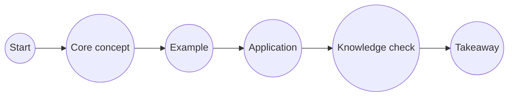

# Recommended Self-Paced Lesson Format

## 1. Use two reading modes

Each lesson should offer both formats without duplicating content.

### Guided mode

* Present one meaningful section at a time.
* Use Previous and Continue navigation.
* Show the learner’s current position.
* Allow learners to revisit or skip to any section.
* Make this the default mode for new learners.

### Full lesson mode

* Display all sections as one continuous page.
* Preserve normal scrolling, searching, copying, and scanning.
* Use section navigation to jump within the lesson.
* Remember the learner’s preferred mode if practical.

Both modes should use the same lesson URL, content, section metadata, and progress data.

---

## 2. Organize lessons into meaningful stations

Divide each lesson into approximately four to six learning sections. A typical lesson can follow this structure:

1. Opening question or scenario
2. Core concept
3. Explanation or supporting concept
4. Example, diagram, or interaction
5. Knowledge check
6. Key takeaway

Sections should represent distinct learning ideas rather than arbitrary paragraph lengths.

Avoid creating a separate step for every paragraph, example, card, or quiz question.

---

## 3. Use a subway-style lesson map

The subway diagram represents the lesson’s internal learning path.



Each station should have a clear state:

* Not visited
* Current
* Visited
* Completed

Learners should be able to click any station. Later sections generally should not be locked because this is a self-paced learning tool.

### In guided mode

The subway diagram acts as step navigation.

### In full-lesson mode

It acts as a table of contents:

* Clicking a station scrolls to its section.
* The active station updates as the learner scrolls.
* Previous and Next move to adjacent sections.

### Responsive behavior

* Desktop: horizontal subway line
* Mobile: compact current-station indicator that expands into a vertical route map

Avoid squeezing numerous labeled stations into a narrow horizontal mobile layout.

---

## 4. Use interactions selectively

Different concepts should use different presentation patterns.

| Content type                | Recommended presentation   |
| --------------------------- | -------------------------- |
| Definition or explanation   | Short prose section        |
| Sequential process          | Stepper, flow, or timeline |
| Alternative perspectives    | Cards or tabs              |
| Categories with comparisons | Grid or comparison table   |
| Scenario or application     | Interactive exercise       |
| Knowledge check             | One question at a time     |
| Summary                     | Key-takeaway card          |

Cards should represent meaningful alternatives, stages, or examples. They should not merely hide ordinary paragraphs to reduce visible page length.

---

## 5. Present knowledge checks one question at a time

Stacked quiz questions can make a lesson appear much longer than its instructional content.

Recommended behavior:

* Show one question at a time.
* Give immediate feedback after submission.
* Explain why the answer is correct.
* Where useful, explain why each alternative is incorrect.
* Let learners retry or continue.
* Show progress such as “Question 2 of 3.”
* Summarize the result before the takeaway.

Quiz completion can contribute to progress but should not necessarily block the learner from continuing.

---

## 6. Keep the navigation hierarchy clear

The course should have three distinct levels:

| Level              | Purpose                                          |
| ------------------ | ------------------------------------------------ |
| Module             | Groups lessons around a broader subject          |
| Lesson             | Covers one learning objective                    |
| Section or station | Breaks the lesson into digestible learning steps |

Interactions such as cards, tabs, and questions belong inside a section. They should not create another competing navigation hierarchy.

---

## 7. Suggested reusable lesson schema

Each lesson can be authored as an ordered collection of sections:

```ts
interface LessonSection {
  id: string;
  title: string;
  shortTitle?: string;
  type:
    | 'introduction'
    | 'concept'
    | 'example'
    | 'interactive'
    | 'knowledge-check'
    | 'takeaway';
  content: React.ReactNode;
}
```

The same collection can power:

* Guided-mode pagination
* Full-lesson rendering
* Subway stations
* Section anchors
* Active-section tracking
* Previous and Next navigation
* Lesson progress

This avoids maintaining separate guided and long-form versions.

---

## 8. Example: Lesson 01.1

**What Is Public Financial Management?**

1. Start — opening classroom question
2. What is PFM? — definition and scope
3. Public services — every service has a budget behind it
4. Budget actors — citizens, agencies, oversight institutions, and civil society
5. Check your understanding — service-to-budget questions
6. Key takeaway — PFM turns public money into public services

The subway map should represent these six sections. Individual paragraphs and quiz questions remain inside their respective sections.

---

## Overall recommendation

Keep the existing lesson-sized content, but change its presentation from a continuous article into a navigable learning path.

The default experience should be guided and sectioned, while the full-lesson option preserves the long-form format for learners who prefer to scroll, scan, search, or reread. The subway diagram should unify both modes by serving as step navigation in guided mode and a section map in full-lesson mode.
