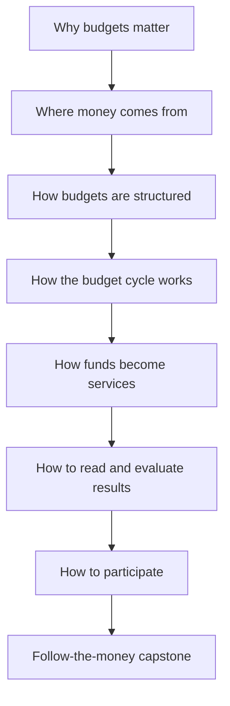

# PH Budget 101: Understanding Philippine Public Financial Management

A self-paced, foundational course on how the Philippine public financial management system works. It teaches the PFM system first and advocacy second: advocacy is presented as the application of budget literacy, not the organizing frame of the course.

Primary source: *Budget Natin: A Guidebook for Engaging the Philippine Budget Cycle* (2023). This course is a redesign of that material, not a page-by-page conversion.

> This outline is the source of truth for course scope and sequence. Build organization lives in [`build_spec.md`](build_spec.md), and each module is specified in detail under [`modules/`](modules/) — see the module registry there for the file list.

## Audience

* General learners with no prior budget or PFM background: students, young professionals, journalists, researchers, and engaged citizens.
* The course is deliberately general-purpose. Tailored variants — for CSOs, government workers, policy bodies, and similar audiences — are future adaptations built on this same core, not separate forks.
* Plain-language English; every technical term is defined at first use.

## Language

* English only for the initial build.
* Localization (starting with Filipino) is a planned later phase. To keep it feasible: avoid idioms that resist translation, keep UI strings separate from content in the codebase, and use locale-aware number and date formatting from the start.

## 0. Start Here

Purpose: Orient the learner and establish a baseline.

* What this course covers
* Who the course is for
* What learners should be able to do afterward
* Short diagnostic quiz
* Choose a learning path:

  * Quick overview
  * Full PH Budget 101
  * Topic-based reference

Interactive element: “Where does government money come from, and where does it go?” initial concept map.

---

## 1. Why Public Financial Management Matters

Purpose: Connect budgets to public services and everyday outcomes.

* What is Public Financial Management?
* Why government needs a budget
* Budget as:

  * A financial plan
  * A statement of priorities
  * A legal authorization
  * An accountability mechanism
* Relationship between policies, plans, budgets, programs, and services
* Difference between announcing a program, funding it, and implementing it
* Roles of citizens, government officials, oversight institutions, and civil society

Interactive element: Trace a public concern—such as classrooms, health centers, or flood control—from community need to government expenditure.

---

## 2. The Government’s Money

Purpose: Explain the resource side of the budget before discussing allocation.

* Where government money comes from

  * Taxes
  * Fees and charges
  * Dividends and other non-tax revenues
  * Borrowing
  * Grants
* National versus local government revenues
* Revenue forecasts
* Deficits, surpluses, and public debt
* Fiscal space and competing priorities
* Why government cannot simply fund every proposal
* Difference between budget authority and available cash

Interactive element: Balance a simplified government budget while responding to changing revenue and borrowing conditions.

---

## 3. Anatomy of the Philippine Budget

Purpose: Teach learners how budget information is organized.

* National and local budgets
* General Appropriations Act
* National Expenditure Program
* Budget of Expenditures and Sources of Financing
* Agency budgets and special-purpose funds
* Programs, activities, and projects
* Expense classes:

  * Personnel Services
  * Maintenance and Other Operating Expenses
  * Financial Expenses
  * Capital Outlays
* Organizational, sectoral, geographic, and funding-source classifications
* Appropriations, allotments, obligations, disbursements, and expenditures
* Current versus continuing appropriations

Interactive element: Click through an annotated sample budget entry and identify the agency, program, expense class, amount, and intended result.

---

## 4. The Philippine Budget Cycle

Purpose: Provide the main organizing framework for the course.

### 4.1 Budget Preparation

* Fiscal targets and budget priorities
* Agency proposals
* Budget call
* Technical budget hearings
* Executive review
* Preparation of the NEP

### 4.2 Budget Legislation

* Submission to Congress
* Committee hearings
* House and Senate deliberations
* Bicameral conference
* Presidential approval and veto
* Enactment of the GAA

### 4.3 Budget Execution

* Release of allotments
* Cash programming and disbursement
* Procurement and implementation
* Agency responsibilities
* Budget adjustments and realignments

### 4.4 Budget Accountability

* Financial and physical accomplishment reporting
* Agency performance review
* Internal controls and audit
* Congressional and public oversight
* Lessons feeding into the next budget cycle

Interactive element: A navigable annual timeline showing documents, decisions, institutions, and participation points at every phase.

---

## 5. From Appropriation to Public Service

Purpose: Show that an approved budget does not automatically produce results.

* The expenditure chain
* Appropriation versus actual spending
* Allotment, obligation, disbursement, and delivery
* Procurement’s place in the process
* Physical and financial performance
* Common causes of underspending and implementation delay
* Outputs versus outcomes
* Why high utilization does not necessarily mean good performance
* Why low utilization does not always mean funds were wasted

Interactive element: Follow a school-building project from appropriation through procurement, construction, payment, and service delivery.

---

## 6. Understanding Local Government Budgets

Purpose: Introduce the distinct PFM structure of LGUs.

* Sources of local revenue
* National Tax Allotment and other transfers
* Local development planning and investment programming
* Local budget preparation and authorization
* Local chief executive and sanggunian roles
* Local development councils and special bodies
* Devolution and the Mandanas-Garcia ruling
* Local budget execution and accountability
* Citizen and CSO participation points

Interactive element: Build a simplified municipal budget under revenue, statutory, and sectoral constraints.

---

## 7. How to Read Budget Documents and Data

Purpose: Develop practical budget literacy.

* Which document answers which question
* How to navigate:

  * NEP
  * GAA
  * BESF
  * Agency budget documents
  * Budget execution reports
  * Audit reports
  * Local budget documents
* Reading tables, classifications, footnotes, and special provisions
* Nominal versus real values
* Proposed, approved, released, obligated, and disbursed amounts
* Year-on-year comparisons
* Finding “avalanches” and “increments”: spotting unusually large increases, decreases, and items that appear or disappear across budget years
* Per-capita and geographic comparisons
* Common analytical mistakes
* Data limitations and comparability issues

Interactive element: Guided document exploration with tooltips, highlighting, search tasks, and short interpretation exercises.

---

## 8. Evaluating Budget Decisions

Purpose: Move from reading figures to assessing their meaning.

* Connecting needs, policies, allocations, implementation, and outcomes
* Basic criteria:

  * Adequacy
  * Efficiency
  * Effectiveness
  * Equity
  * Sustainability
  * Transparency
  * Accountability
* A quick screen from the policy analysis pyramid: *Tama ba? Kaya ba? Susuportahan ba?* (Is it right? Is it feasible? Will it be supported?)
* Baselines, targets, and performance indicators
* Identifying gaps between plans and budgets
* Evaluating distribution across populations and places
* Following budget changes over time
* Distinguishing evidence from assumptions

Interactive element: Compare competing budget proposals and explain which one better addresses a defined policy problem.

---

## 9. Participating in the Budget Process

Purpose: Translate budget literacy into meaningful engagement.

* Why participation matters
* Community listening and problem definition
* Identifying the correct institution and decision-maker
* Entry points throughout the budget cycle
* Budget consultations and hearings
* Preparing an evidence-based budget proposal
* Completed Staff Work: packaging the proposal so the decision-maker only needs to approve or disapprove
* Coalition building
* Communicating budget findings
* Monitoring implementation
* Feedback and accountability mechanisms

Interactive element: Create a basic engagement plan by choosing an issue, budget stage, target institution, evidence, message, and desired decision.

---

## 10. Capstone: Follow the Money

Purpose: Integrate the entire course.

The learner selects a sector or project, such as:

* Education
* Healthcare
* Agriculture
* Public transportation
* Social protection
* Flood control
* Local infrastructure

They then complete a guided investigation:

1. Define the public need.
2. Identify the responsible institution.
3. Find the relevant budget allocation.
4. Determine its stage in the budget cycle.
5. Compare approved and actual expenditure.
6. Examine physical accomplishments.
7. Identify an implementation or accountability issue.
8. Propose a question, recommendation, or participation action.

The final output could be a downloadable one-page “budget investigation brief.”

## Supporting Reference Section

Keep detailed material outside the main learning path so the course remains approachable. Specified in detail in [`reference-section.md`](reference-section.md):

* PFM glossary
* Budget document library
* Institutional map
* Budget calendar
* Classification reference
* Local government budget structures
* Common acronyms
* Legal and policy references
* Sources and attribution
* Data-source directory
* Frequently asked questions

## Recommended lesson pattern

Each lesson can use a consistent structure:

1. A concrete public-service question
2. A short concept explanation
3. A visual or interactive example
4. A worked example or real Philippine case — factual and neutral; no named advocacy organizations, campaigns, or personalities
5. A guided activity
6. A knowledge check
7. A concise takeaway
8. Optional deeper reading

This produces a clearer learning arc:

## Sourcing notes

How the course content maps to the guidebook:

* Strong guidebook coverage: Modules 4, 6, and 9 (budget cycle via Chapter 3 and Annex 1; local budgets via Chapter 2; participation, coalitions, and staff work via Chapters 1 and 6 and Annexes 2–3), plus the reference section (glossary, acronyms, further reading).
* Partial coverage: Modules 1, 3, 7, and 8 — the concepts are distributed across guidebook Chapters 3–5 (budget documents, avalanches and increments, the policy analysis pyramid).
* New authoring required: Modules 0, 2, and 5, and parts of 7–8 (revenue, debt and fiscal space; the expenditure chain, procurement, and underspending; nominal versus real values; per-capita comparisons; evaluation criteria). Draw from official DBM, DOF, NEDA, DBCC, COA, and BTr primers and published data.
* Worked examples for the case slot come from three sources: public budget facts (laws, enacted allocations, programs), the guidebook's own worked analyses (anonymized where they name organizations or individuals), and clearly-labeled illustrative composites. Learner-facing content names no advocacy organizations, coalitions, campaigns, or personalities — government institutions, laws, and public documents only.

## Interactive elements: build phases

Phase 1 (MVP — linear, static-data interactives):

* Module 1: trace-a-concern click-through flow
* Module 3: annotated sample budget entry (hotspots)
* Module 4: budget cycle timeline (core organizing visual)
* Module 5: school-building project step-through
* Module 9: engagement plan builder (form to downloadable plan)

Phase 2 (assessment and integration):

* Module 0: concept map and diagnostic quiz
* Module 8: proposal comparison exercise
* Module 10: capstone investigation workbook producing the downloadable brief; ships with a curated sample dataset per sector

Phase 3 (simulations and data-heavy tools):

* Module 2: budget balancer simulation
* Module 6: municipal budget builder
* Module 7: guided document explorer (depends on a sample document corpus)

Rationale: Phase 1 delivers the complete course narrative with simple, low-maintenance interactives. Phase 2 adds assessment and the integrating capstone. Phase 3 tools need simulation logic or data pipelines and can land after the course content stabilizes.
